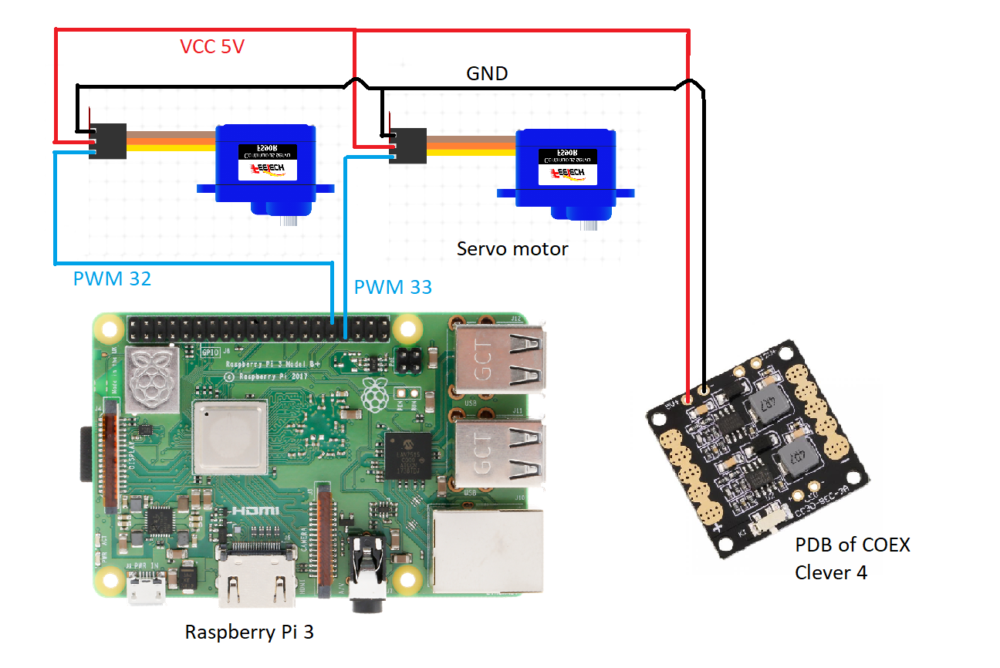

# TreeSeedQuad
SEED SPREADING QUADCOPTER

If you want to make seeding drone from COEX Clover 4.2 drone it is project for you.

# Aim
We need to save trees by protecting them from the destructive human activities like clearance of forests, deforestation for urbanization, etc. Trees are the lungs for the earth. It is an important part of nature’s ecosystem. They balance the soil composition and also act as the barrier for wind and storm. Thus, they provide various uses to the ecosystem. For these reasons, it’s imperative that we save trees.

Seed-firing drones will, as the name suggests, fire seeds into fertile soil to allow millions of trees to grow back after being cut down for industrial use. If the rate of planting exceeds the rate of cutting, eventually we will restore the trees we once felled.

# How it works
We will make drones able to hold seeds onboard and drop them in an area which we drove in a special application. We can control the density of the seeds and the height of the drop. We also thought about protection of the seeds from insects, animals and dehydration. We choose the earth ball technique invented by Masanobu Fukuoka, aka Fukuoka Technique. This earth ball contains all needed elements to grow, plant seeds and earth for protection. When we drop it on the ground, the earth ball will hold seeds until it gets the needed amount of water and seeds will begin to grow.

# Fukuoka technique
In southern Japan, the Japanese farmer and philosopher Masanobu Fukuoka invented a seed ball planting technique. The method is regarded as a natural farming technique that requires no machines, no chemicals and very little weeding. By the use of seed balls, land is cultivated without any soil preparation.

- Required materials for making seed balls:
1. 1 bucket Clay 
2. 1 bucket Organic Dark Soil / Compost 
3. 1 bucket Water (amount of water may vary depending on the soil type) 
4. ¼ bucket Seeds 

- Steps for making seed balls
1. Collect same quantity of both clay and organic soil. For example, if you use one bucket of clay, then you should mix with one bucket of organic soil.
2. Sieve the clay and organic soil to get fine particles. The natural clay and organic soil come with thicker particles. Therefore, they need to be sieved thoroughly to become fine particles.
3. Mix the clay and organic soil by adding appropriate amount of water slowly until the mixture begins to stick firmly. The process requires pouring water little by little to mix with soil for better bonding.
4. Take a bit of mixture and roll it into balls. Test the ball by throwing it on a flat surface. If the ball doesn’t break easily, it means it has got good bonding.
5. Insert seeds (1 to 2 seeds per seed ball for permanent trees such as mahogany, sandalwood, orange, moringa…) (± 5 seeds per seed ball for vegetables, flowers, grasses, clovers…)
6. Dry the seed balls for one to two days in a shaded area, if properly dry, the seed balls will be protected from external predators such as chickens, birds, rats…

Advantages of seed balls
- It is simple and easier to make seed balls without machines
- Easier for reforestation and plantation in difficult terrains
- Contribute to protect soil, environment and livelihood
- It is an organic technique and doesn’t use any chemicals
- It is a low-cost method compared to traditional afforestation/reforestation techniques
- It requires low maintenance

# Which Seeds used
Apple Seeds

# Size and weight of the seed capsule
Size and Weight of seed capsules are very important for this project. 
After some experiments we decided that best size is maximum 18mm and maximum weight is 10 gram 

# Dropping Mechanism
Designed a Dropping mechanism that can carry 16-18 seed capsules.
Used small dc motor for the dropping mechanism with 3D printed rack and pinion gear system. PCB Designed for dual motor driver TB6612FNG. Motor driver's pins are connected to T-blocks. There are 4 holes in PCB, so it can be mounted to quadcopter.

