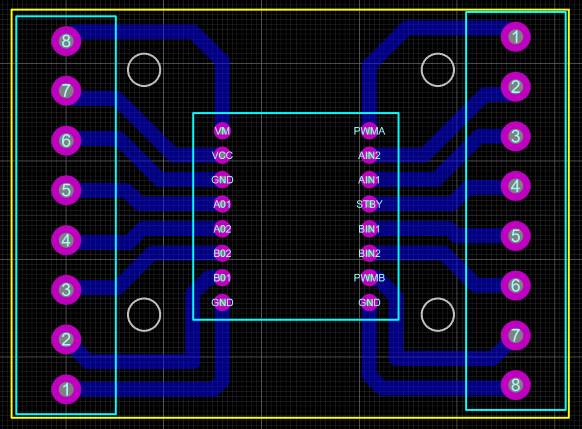

# TreeSeedQuad
SEED SPREADING QUADCOPTER

# Droping mechanism (Yussuf)

# PCB Design (Zuhra)
PCB Design for dual motor driver TB6612FNG and T-blocks. 
Motor driver's pins are connected to T-blocks.

# Sample programs (Dilbara)

# Seed capsules (Tilek)

# Mission planning

# GPS maps (Tilek)
